# Web fonts com Inkscape

  O objetivo deste documento é mostrar como podemos criar webfonts com o Inkscape e como implementar essa nova fonte no seu CSS;
  No exemplo mostrarei com ícones, mas pode facilmente ser adaptado para letras.
   
  Os ícones não são de minha autoria: <i><a href="http://www.freepik.com" title="Icons made by Freepik">Icons made by Freepik </a>from <a href="https://www.flaticon.com/" title="Flaticon">www.flaticon.com </a>is licensed by <a href="http://creativecommons.org/licenses/by/3.0/" title="Creative Commons BY 3.0" target="_blank">CC 3.0 BY </a>></i>
   

<ul>
 <h3>Roteiro:</h3>
  <li>Qual tipo de template abrir no Inkscape</li>
  <li>Como iniciar uma fonte</li>
  <li>Como configurar e posicionar ícones</li>
  <li>Como atribuir a aquela imagem a seu texto equivalente</li>
  <li>Como transformar o arquivo SVG em TTF</li>
  <li>Como colocar essa font TTF na web</li>
  <li>Como usar sua fonte em um arquivo CSS</li>
</ul>

  

<h2>Passo 1: Setup </h2>

  <h4>Você vai precisar de:</h4>
  <ul>
    <li>Inkscape instalado</li>
    <li>Alguns arquivos SVG monocromaticos (você pode baixar ou criar esses arquivos, fica a seu critério)</li>
  </ul>

 

  Abra o Inkscape, vá no menu "Arquivo" e procure a opção "New from Template" confrme indica a imagem. Ou utilze o atalho de teclado (CTRL + ALT + N)   
  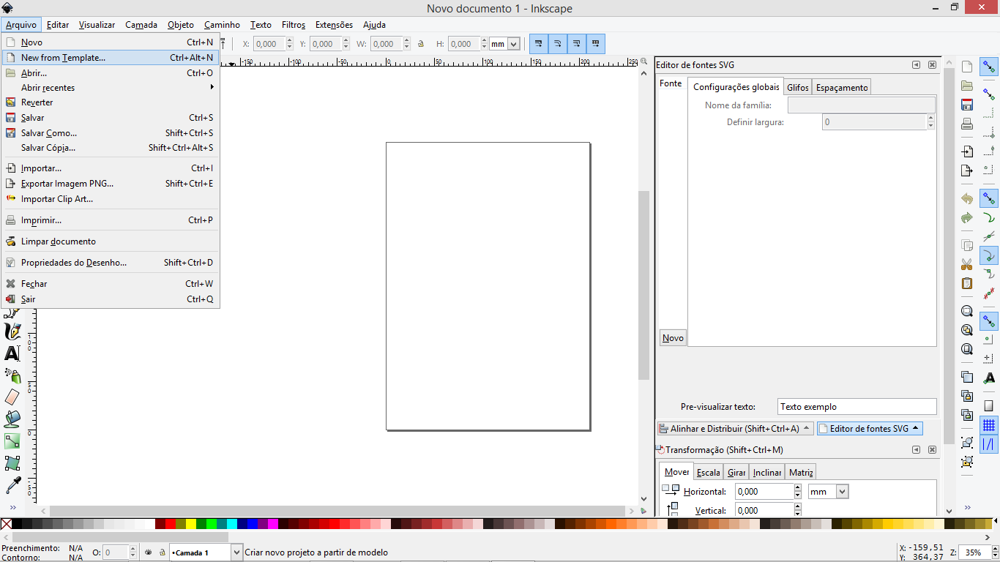
  <i><h6>Menu Arquivo/"New from Template"</h6></i> 

  Ao clicar nessa opção abrirá uma janela. Acesse a opção "Tela de tipografia"   
  
  <i><h6>Janela de opções de template</h6></i> 
  
  A nova janela aberta deve parecer com essa:    
  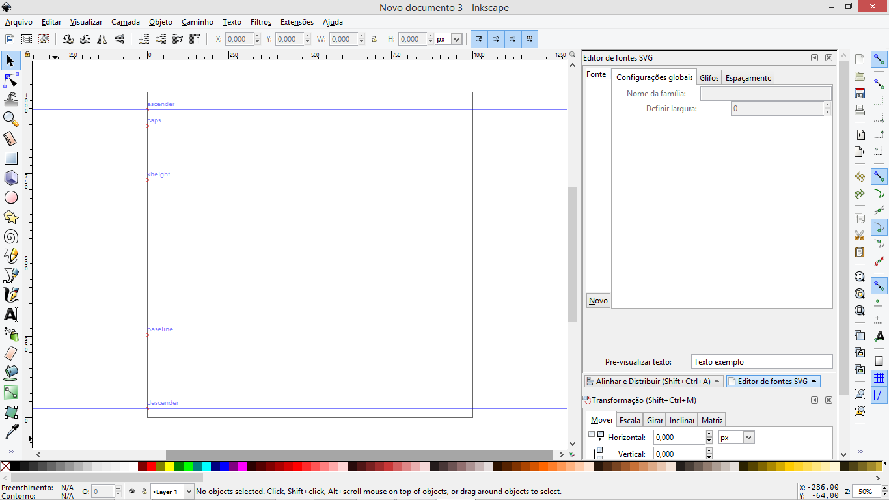
  <i><h6>Tela de tipografia</h6></i> 

 

<h2>Passo 2: Iniciando uma fonte </h2>

  Localize na tela o quadro "Editor de fontes SVG" e clique no botão "Novo" para criar um novo arquivo de fonte.  
  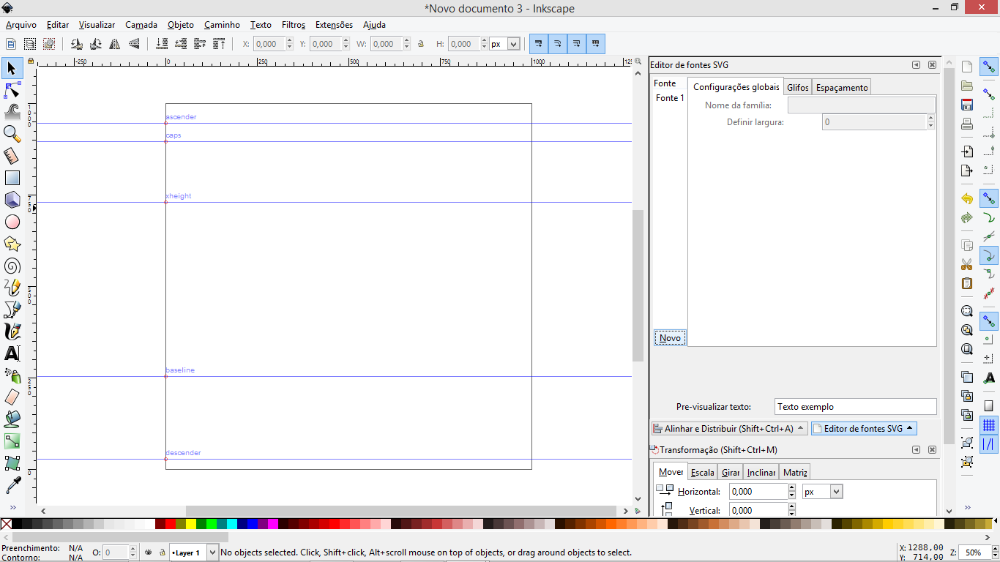
  <i><h6>Tela de tipografia - Editor de fontes SVG</h6></i> 
  
  Ao clicar em Fonte 1, algumas caixas ficarão disponiveis. Se quiser dê um nome para sua fonte. 
  
  <i><h6>Editor de fontes - Nomeando uma fonte</h6></i> 
  
  Observe que a aba padrão é a "Configurações globais", troque para a aba "Glifos". Você verá as seguintes opções: 
  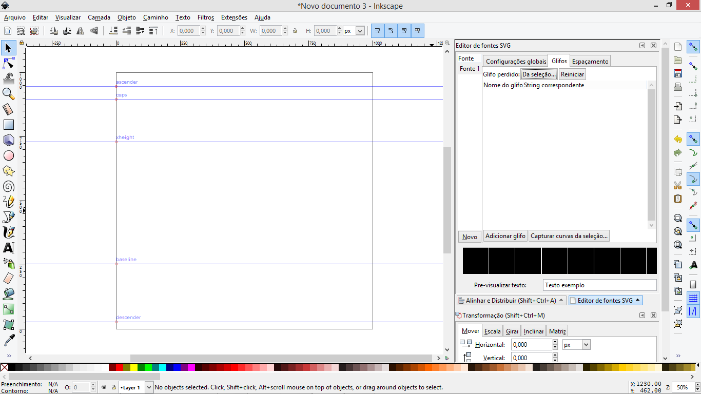
  <i><h6>Editor de fontes - Glifos</h6></i> 
  
  Aqui nos geraremos as letras correspondentes aos arquivos SVGs que iremos importar. Clique em adicionar glifo. 
  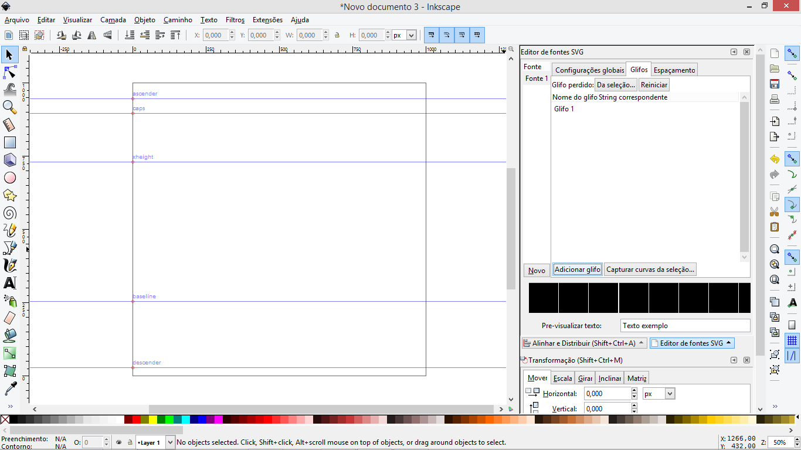
  <i><h6>Editor de fontes - Glifos</h6></i> 
  
  Há duas colunas nessa tela, uma de glifos e outra de string correspondente. Na de string digite algum texto. 
  
  <i><h6>Editor de fontes - Glifos</h6></i> 
  
  Repita a operação quantas vezes desejar. Altere também o texto de pre visualização para que esteja compativel com seus glifos 
  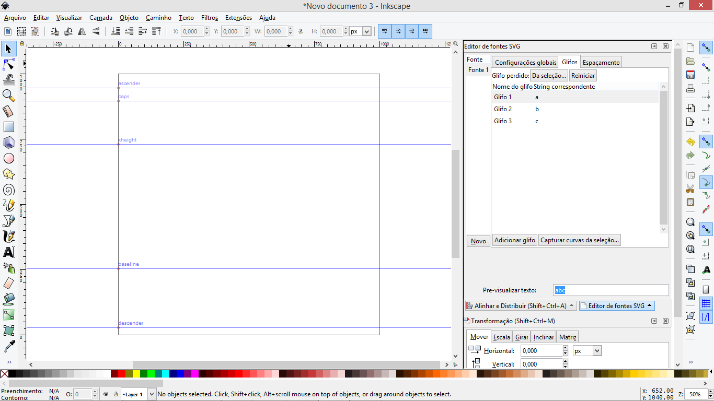
  <i><h6>Editor de fontes - Glifos</h6></i> 

 

<h2>Passo 3: Configurando e posicionando ícones</h2>

  Acesse o menu "Arquivo" e depois clique em "Importar". Se preferir utilize o atalho "CTRL + I". Selecione o arquivo SVG que deseja importar.  
  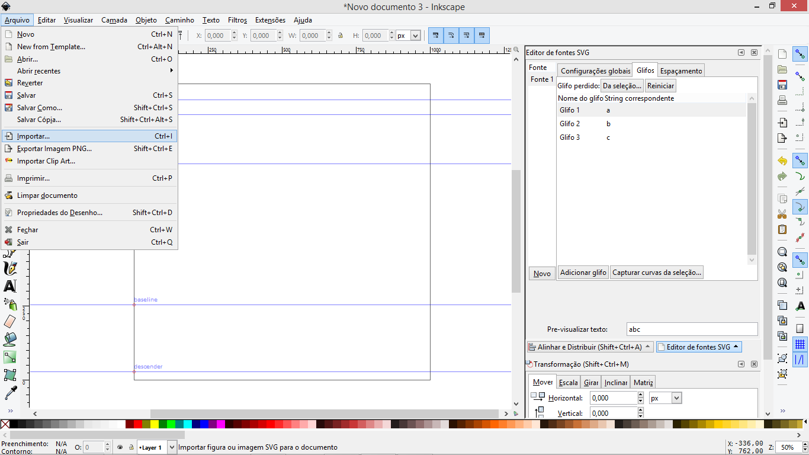
  <i><h6>Importando arquivo SVG</h6></i> 
  
  O arquivo importado aparecerá fora da folha para que nós possamos organizar como preferirmos.  
  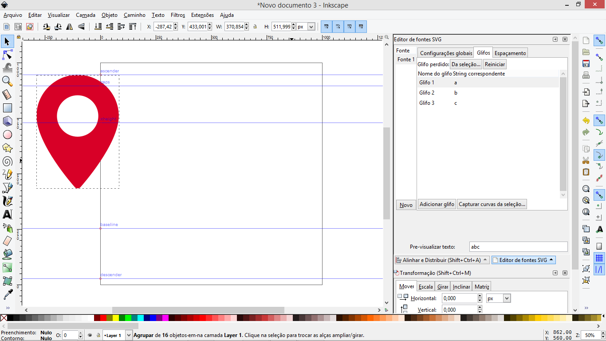
  <i><h6>Importando arquivo SVG</h6></i> 
  
  Antes de ajustar a posição, primeiramente vamos criar um padrão de tamanho. Pressionando a telha CTRL clique em uma das flechinhas das extremidades/pontas e arraste para redimensionar em escala, até que o arquivo fique do tamanho da folha. 
  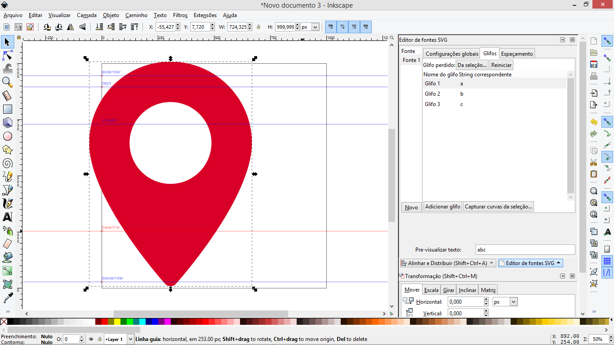
  <i><h6>Redimensionando arquivo</h6></i> 
  
  Abaixo do quadro "Editor de fontes" há um botão escrito "Alinhar e Distribuir". Clique ali ou acesse seu atalho de teclado (SHIFT + CTRL + A). 
  
  <i><h6>Alinhando arquivo</h6></i> 
  
  Agora centralizaremos o ícone na folha. Primeiramente a opção centralizar no eixo vertical.
  <b>Atenção:</b> nessa etapa é importante que a opção "Relativo a" esteja com "Folha" selecionado. 
  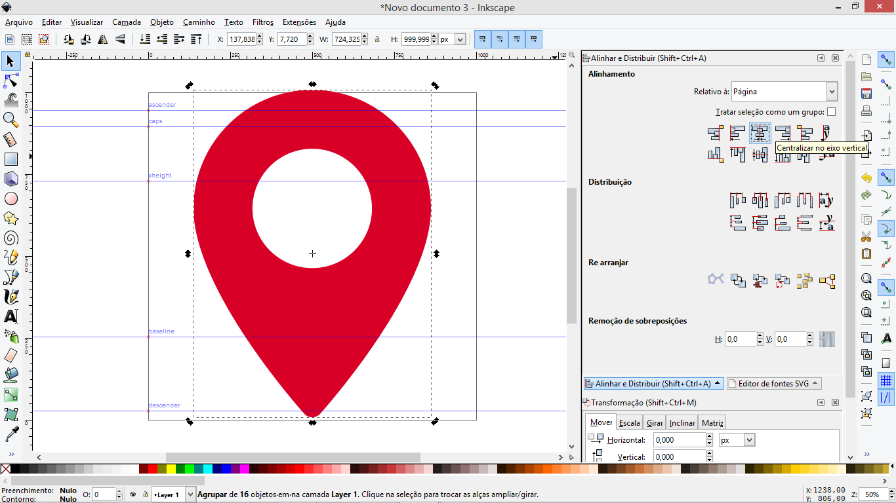
  <i><h6>Alinhando arquivo - vertical</h6></i> 
  
  Após centralizar na vertical, agora centralizaremos na horizontal. O Inkscape pegará essas referências na hora de transformar essa imagem em "letra".  
  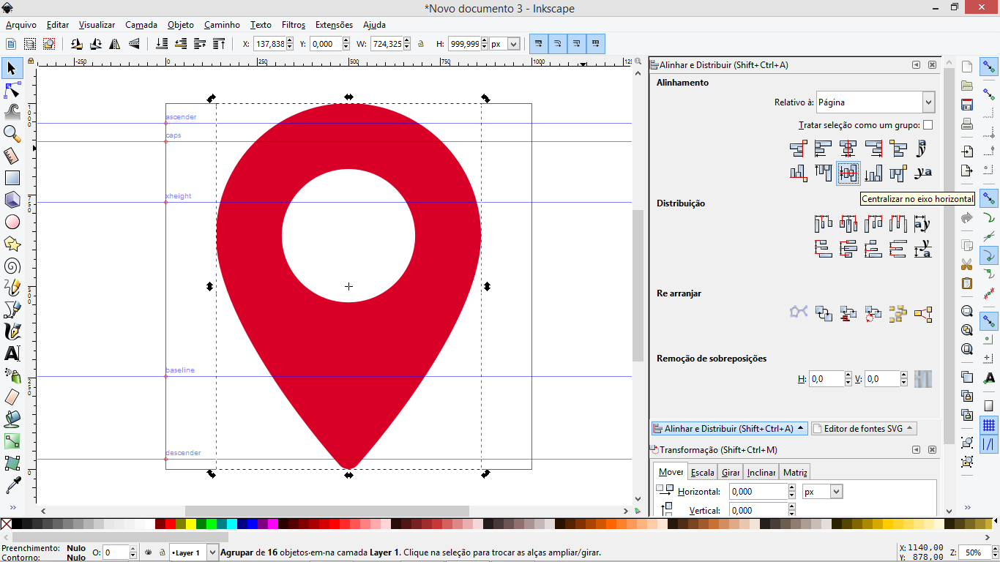
  <i><h6>Alinhando arquivo - horizontal</h6></i> 
  
  Quando criamos icones/letras utilizamos camadas e as agrupamos. Porém para criar um caracter ele analisará o contorno. Pra ver o contorno de uma maneira genérica, vamos desagrupar todas as camadas e depois vincula-las em um conjunto só. Se essa sequencia não for bem realizada o Inkscape não cnseguirá fazer essa transformação. 
  Para desagruparmos as camadas pode-se encontrar a opção desagrupar com o botão direito do mouse ou utilizar o atalho de teclado (SHIFT + CTRL + G). 
  
  <i><h6>Desagrupando camadas</h6></i> 
  
  Repita o desagrupamento até que na barra de status apareça a mensagem "Nenhum grupo para desagrupar na seleção". 
  
  <i><h6>Desagrupando camadas - barra de status</h6></i> 
  
  Agora é o momento de unir o que foi desagrupado. Para isso acesse o menu "Caminho" e selecione a opção "União", ou utilize o atalho de teclado (CTRL + +). 
  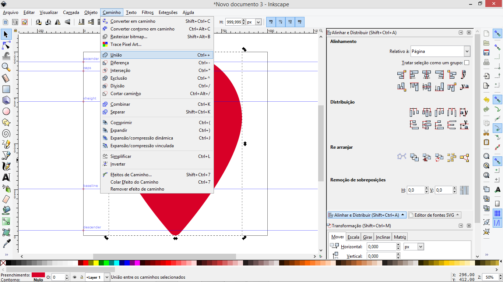
  <i><h6>Unindo camadas desagrupadas</h6></i> 
  
  Troque a cor do ícone para preto selecionando na caixa de cores na parte inferior da janela. 
  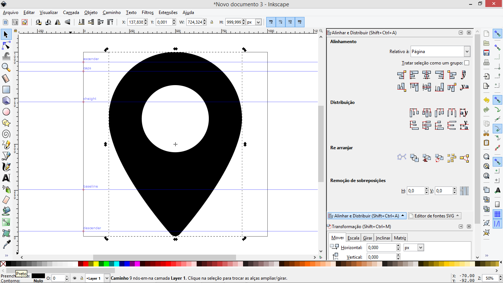
  <i><h6>Cor padrão de fontes: preto</h6></i> 

 

<h2>Passo 4: Identificando o icone</h2>

  Eu gostaria que essa imagem fosse equivalente a letra 'a', ou seja, ao usar essa fonte que estamos criando no CSS, ao digitar 'a' deverá aparecer essa imagem. Vá ao quadro "Editor de fontes SVG" clique no primeiro glifo. 
  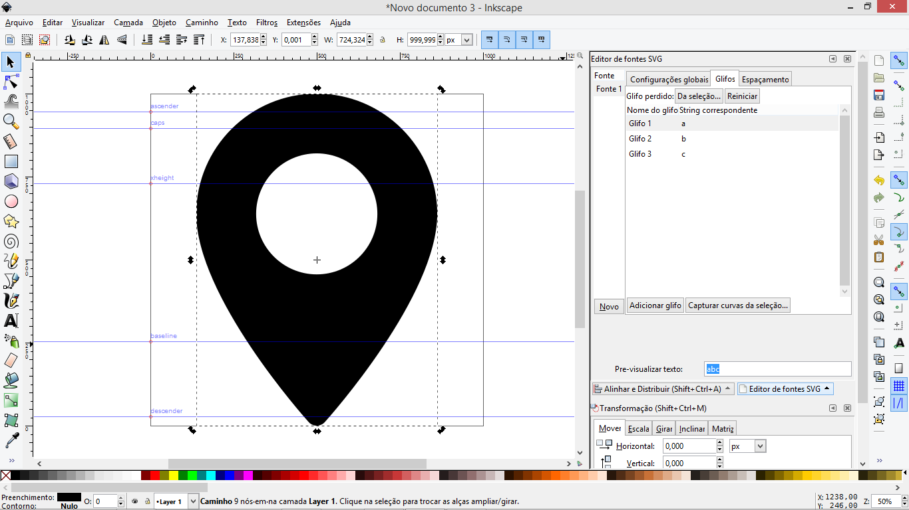
  <i><h6>Editor de fontes SVG - Glifos</h6></i> 
  
  Depois pressione o botão "Capturar curvas de seleção" e observe a sua imagem aparecer correspondente ao texto na opção de pré-visualização. 
  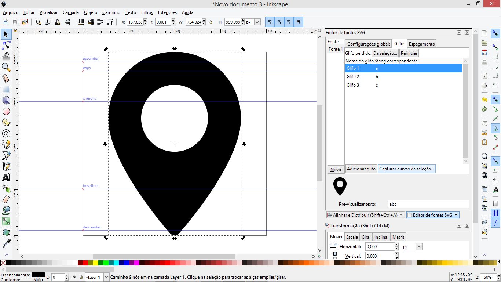
  <i><h6>Editor de fontes SVG - Capturar curvas de seleção</h6></i> 
  
  Repita esses passos para as próximas imagens. A pilha ficará mais ou menos como na imagem abaixo: 
  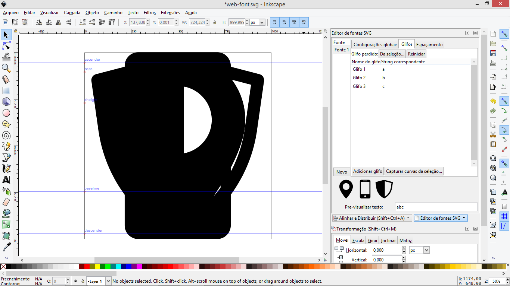
  <i><h6>Pilha de icones</h6></i> 
  
  Após fazer isso para todos os ícones SVG, salve o arquivo como "web-font.svg" ou o nome que desejar. 
  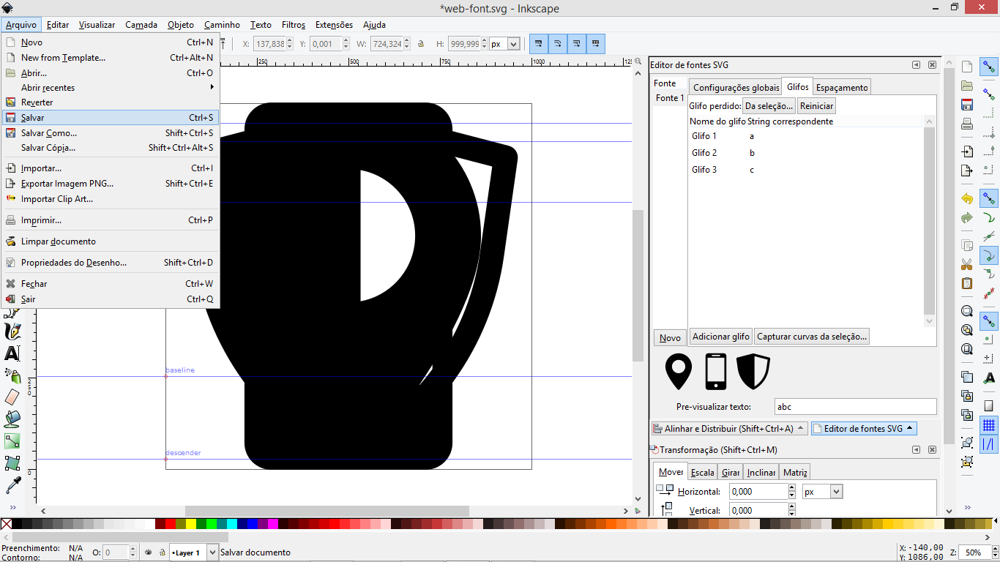
  <i><h6>Salvando arquivo</h6></i> 

 

<h2>Passo 5: Arquivo TTF</h2>

  Ótimo, criamos a fonte, relacionamos as imagens com os caracteres e temos um arquivo SVG como resultante. Porém para utilizarmos como fonte precisamos converter para um arquivo TTF (true type font). Para isso vamos usar um conversor online de SVG para TTF. 
  Eu utilizei o <a href="https://convertio.co/pt/">convertio</a> mas podem utilizar qualquer outro conversor que preferirem.  
  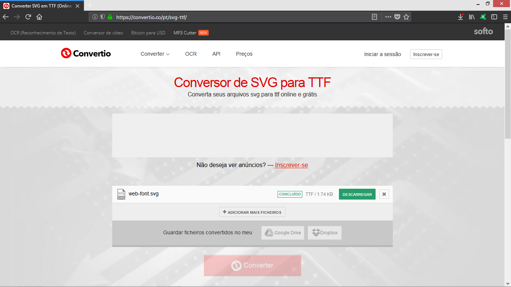
  <i><h6>Criando arquivo de fonte</h6></i> 

 

<h2>Passo 6: Gerando a webfont</h2>

  
  Com o ttf, temos uma fonte. Porém, faltou a parte "web" que gostariamos. Então, para criar um webkit com nossa fonte e finalmente ela se tornar uma web font podemos usar um gerador de web fonts. Eu utilizei o <a href="https://www.fontsquirrel.com/tools/webfont-generator">font squirrel</a> mas podem utilizar qualquer outro gerador que preferirem. 
  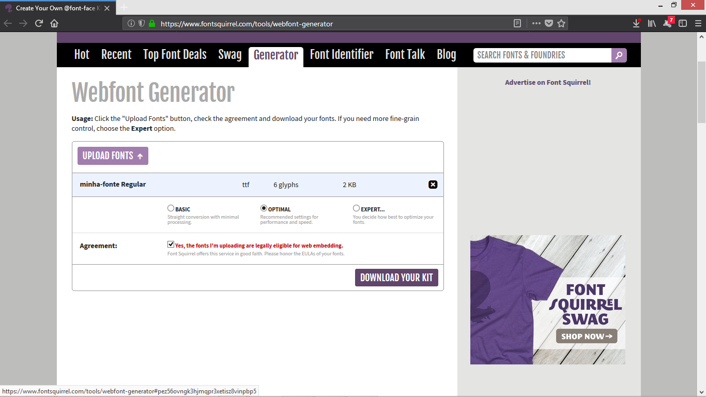
  <i><h6>Gerando webfont</h6></i> 

 

<h2>Passo 7: Aplicando a nova fonte no CSS</h2>

  Essa é a nomenclatura que o site gerou pra gente, esse CSS vem junto no download para testarmos. Implementei a fonte em um título. 
  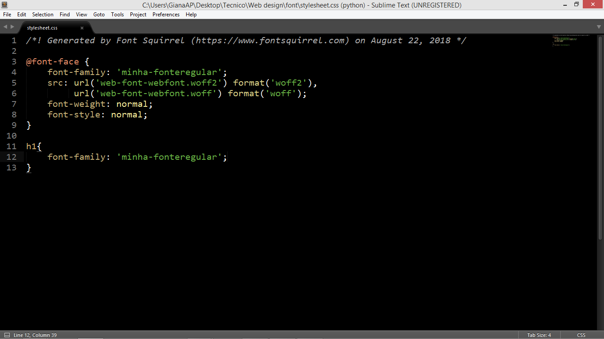
  <i><h6>CSS gerado</h6></i> 
  
  Esse é um código HTML simples para testarmos se funcionou. 
  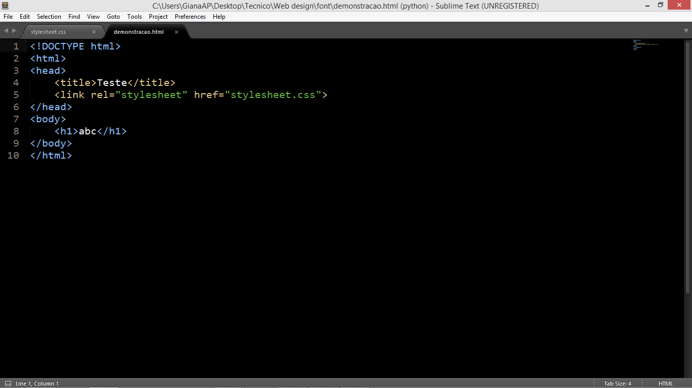
  <i><h6>HTML de teste</h6></i> 
  
  Esse é o print do navegador mostrando nossa webfont.  
  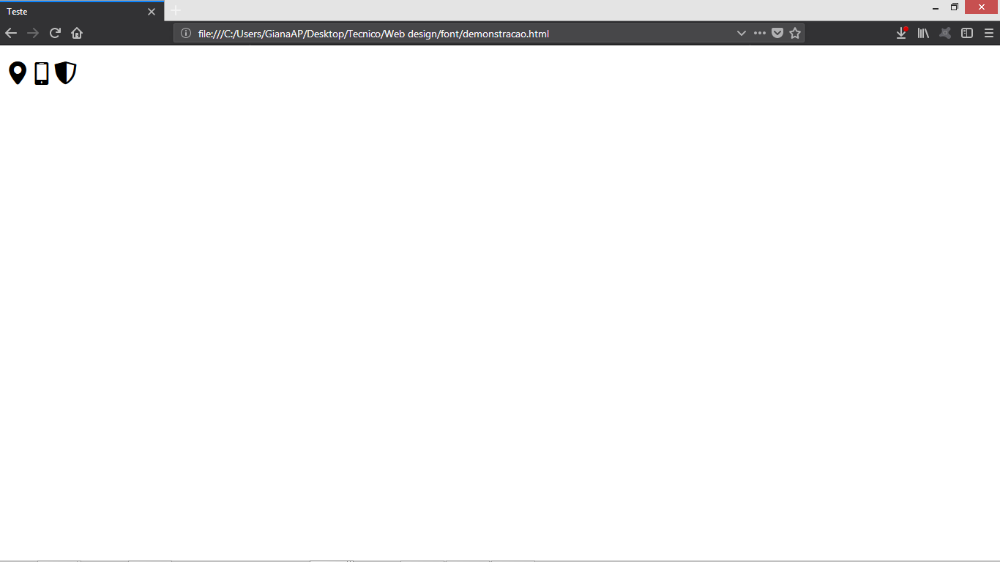
  <i><h6>Webfont validada</h6></i> 
